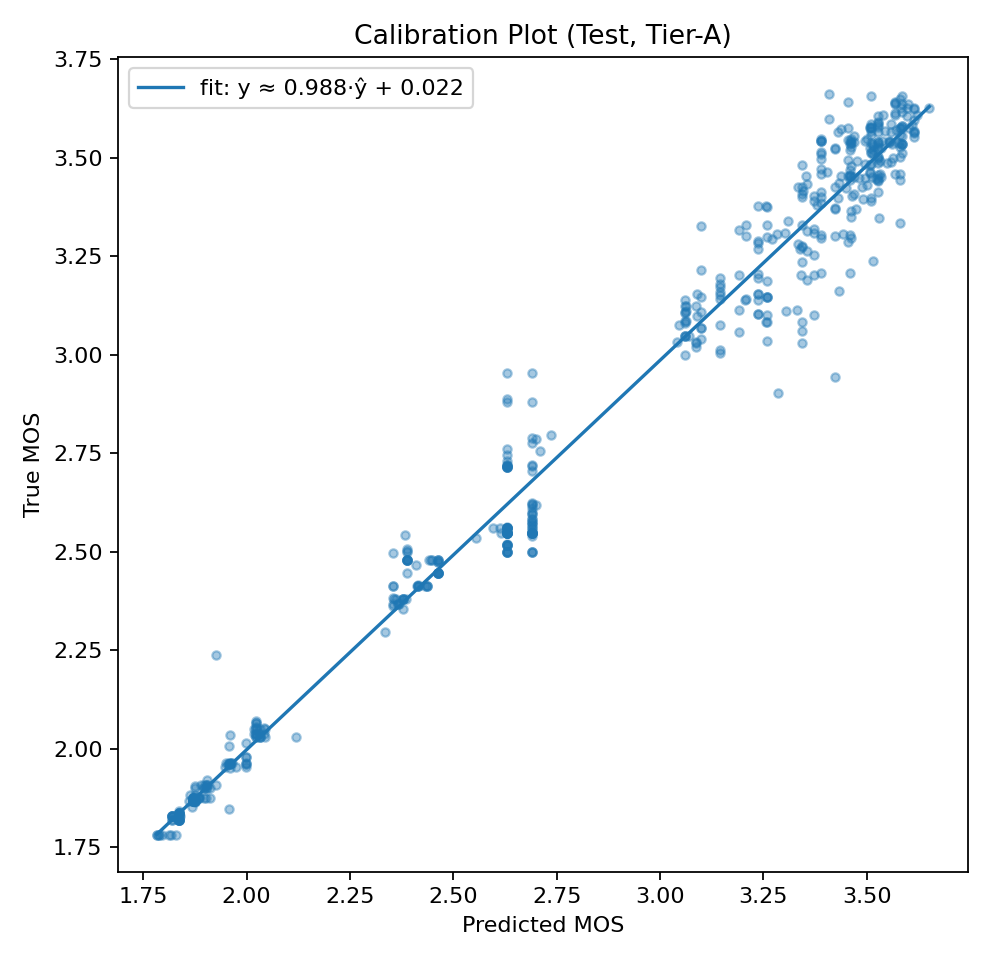

# Vision Transformer (ViT-S/16) for Volumetric Video Quality Prediction (pMOS)

This repository presents a **Vision Transformer (ViT-Small/16)** system for predicting **perceptual video quality (pMOS)** on compressed volumetric videos. The design is intentionally simple but careful. Most of the gains come from **consistent video-level evaluation**, **temporal modeling over 8 frames**, and **light post-hoc calibration**, rather than from complicated architectures.

There is a practical goal here: build something stable enough that it can serve as a reliable proxy for subjective volumetric video quality assessment on this dataset, without pretending it replaces a full subjective campaign. 

## Contents

- [Methodology Summary](#methodology-summary)
- [Dataset](#dataset)
- [Model](#model)
- [Training Setup](#training-setup)
- [Evaluation Protocol](#evaluation-protocol)
- [Results](#results)
- [Ablation Summary](#ablation-summary)
- [Calibration Options](#calibration-options)
- [Per-QP / Per-Compression Analysis](#per-qp--per-compression-analysis)
- [Figures](#figures)

## Methodology Summary

The system uses:
- **Backbone:** ViT-Small/16-224 from `timm` as a feature extractor (`num_classes=0`)
- **Temporal modeling:** temporal attention pooling over **8 frames**
- **Regression:** lightweight head maps pooled embedding to scalar pMOS
- **Training stability:** SmoothL1 (Huber) loss, AdamW, mixed precision (AMP), gradient clipping, EMA weights
- **Evaluation:** strict **video-level** inference using **9 temporal crops** and test-time augmentation (original / horizontal flip / temporal reversal)
- **Calibration:** linear mapping fitted on validation and applied to test predictions

Calibration (validation-fit → test-apply):
- **y = 0.9713 · ŷ + 0.1375** 

## Dataset

The dataset comprises **8,448 volumetric video sequences** created from:
- **4 QPs**
- **3 compression types**
- **4 characters**

Official split (by `video_id`, no leakage):
- **Train:** 4,468 videos  
- **Validation:** 559 videos  
- **Test:** 559 videos 

### Dataset summary table

| Item | Value |
|---|---:|
| Total sequences | 8,448 |
| QPs | 4 |
| Compression types | 3 |
| Characters | 4 |
| Train | 4,468 |
| Validation | 559 |
| Test | 559 |

## Model

### Input representation
For training and evaluation, inference is performed on **temporal crops of 8 frames**:
- frames are **uniformly sampled** within a video
- frames resized to **224 × 224**
- normalized using **ImageNet mean/std**
- a **single video-level prediction** is produced after temporal pooling (no per-frame labels required) 

### Why 8 frames?
Eight frames are used as a pragmatic accuracy–efficiency trade-off. The cost of ViT inference grows approximately linearly with the number of frames, while gains saturate because attention pooling already aggregates information across time. Eight samples provide coverage of the clip and capture dominant compression artifacts without pushing memory/latency budgets. 

## Training Setup

Training is configured for robust regression and stable convergence:

### Optimisation
- **Loss:** SmoothL1 (Huber), β in [0.3, 0.5]; final runs use β ≈ 0.3  
- **Optimizer:** AdamW  
  - lr = 1e-4  
  - weight decay = 0.05  
  - betas = (0.9, 0.999)

### Learning rate schedule
- linear warmup → cosine annealing

### Stability mechanisms
- mixed precision (**AMP**)
- gradient clipping (norm = 1.0)
- **EMA** of weights (decay ≈ 0.9995) used for evaluation and checkpointing

### Data augmentations (train only)
Light augmentations chosen to be “IQA-safe”:
- random resized crop (near full frame)
- horizontal flip
- mild color jitter
- occasional grayscale 

### Model selection
The best checkpoint is selected by **minimum validation video-level RMSE**, using **EMA** weights. 

## Evaluation Protocol

### Test-time augmentation and temporal crops
For each test (and validation) video:
- sample **K = 9** temporal crops, each crop has **8 frames**
- for each crop evaluate 3 views:
  1) original  
  2) horizontal flip  
  3) temporal reversal  
- total predictions per video = **3 × 9**
- average them to produce **one final pMOS** per video

### Post-hoc linear calibration (global)
A linear calibration is fitted only on the validation set:
- **ycal = 0.9713 · ŷ + 0.1375**
This calibration is then applied to test predictions. It reduces MAE/RMSE and preserves correlation structure. 

## Results

### Test performance (video-level, TTA + calibration)
Held-out test set: **N = 559 videos**

| Metric | Value |
|---|---:|
| PLCC | 0.9687 |
| SRCC | 0.9396 |
| R² | 0.9373 |
| RMSE | 0.1586 |
| MAE | 0.1054 |
| Acc@±0.10 | 0.6816 |
| Acc@±0.05 | 0.4079 |

These values indicate strong agreement with subjective MOS at video level, in both correlation and absolute error. 
### Statistical confidence (95% bootstrap CI, 2,000 resamples)
| Metric | Point | 95% CI |
|---|---:|---|
| PLCC | 0.9687 | [0.9612, 0.9758] |
| SRCC | 0.9396 | [0.9265, 0.9495] |
| R² | 0.9373 | [0.9231, 0.9500] |

## Ablation Summary

This table shows the incremental effect of evaluation refinements on video-level performance:

| Model Variant | PLCC | SRCC | R² | RMSE |
|---|---:|---:|---:|---:|
| ViT-S/16 + temporal attn (single view) | 0.9578 | 0.9329 | 0.8740 | 0.2247 |
| + TTA (multi-crop, no calibration) | 0.9687 | 0.9396 | 0.9341 | 0.1624 |
| + TTA + Linear Calibration (final) | 0.9687 | 0.9396 | 0.9373 | 0.1586 |

It is observed that test-time augmentation produces a major reduction in error, and the simple linear calibration aligns predictions to MOS without changing rank correlation. 

## Calibration Options

### Global calibration (primary)
This is the main reported configuration:
- evaluate with 9 crops × 3 views
- apply validation-fitted linear mapping

### Optional per-subset calibration (analysis-time refinement)
A separate linear map is fitted on validation for each **(QP, compression)** bucket and applied to matching test videos. This step is post-hoc and does not change the trained model; it changes only the mapping. It reduces absolute error while preserving correlation.

Tier-A (per-subset calibration, post-hoc):

| Metric | Value |
|---|---:|
| PLCC | 0.9904 |
| SRCC | 0.9738 |
| R² | 0.9804 |
| RMSE | 0.0886 |
| MAE | 0.0615 |
| Acc@±0.10 | 0.7943 |
| Acc@±0.05 | 0.5259 |

This should be presented transparently as a refinement rather than as a new trained model. 

## Per-QP / Per-Compression Analysis

QP and compression labels are derived directly from video identifiers (example given in the report: `..._TEX_QP35` → QP = 35, compression = TEX). Using `eval_preds_test_with_qp_comp.csv`, PLCC and SRCC are computed separately:
- per QP (stored in `metrics_per_qp.csv`)
- per compression (stored in `metrics_per_compression.csv`) 

## Figures

### Figure 1: Predicted vs True MOS (Test, calibrated)

### Figure 2: Calibration plot (validation fit → test apply)

### Figure 3: Training/Validation curves (loss, R², RMSE)

### Figure 4: ViT attention rollout heatmaps (qualitative examples)

